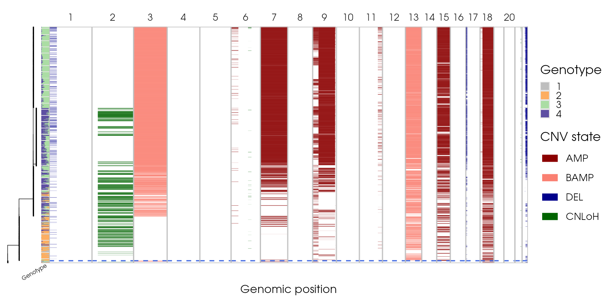
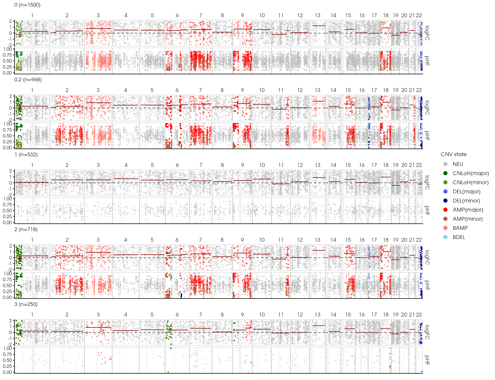
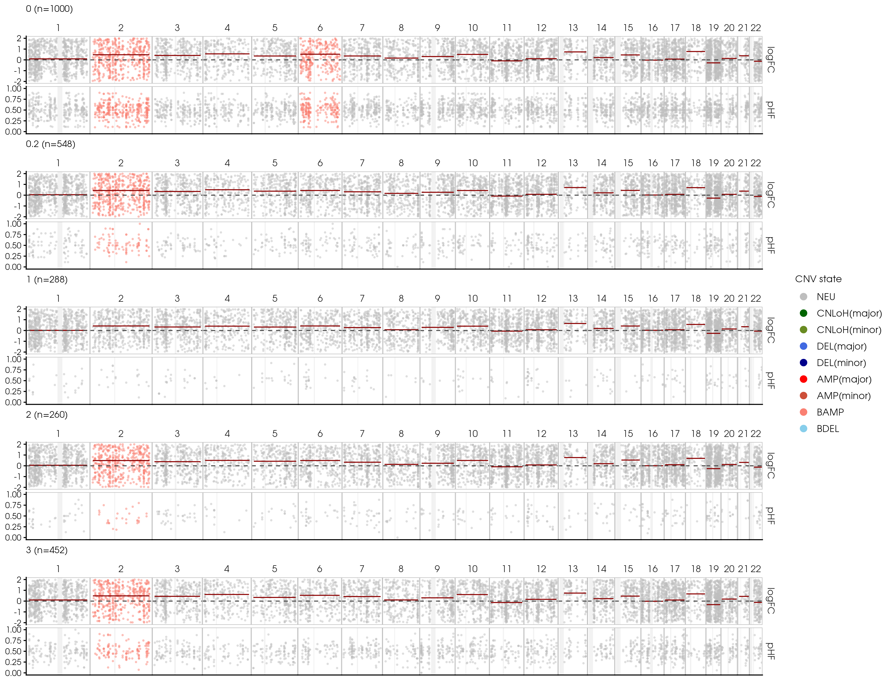

# Copy Number Variation Inference Pipeline
Inference of copy number variation from scRNA-seq and scATAC-seq (TBA) data.

Author: Ding Ma

## Introduction
Copy-number variations (CNV) are a prominent feature of many cancer types, characterized by gains or losses of genomic regions [[1](#references)]. These variations can reveal the deletion or amplification of cancer-related genes, subclonal structures, and genomic patterns associated with pathogenic phenotypes [[2](#references)]. Traditionally, CNVs are profiled via bulk whole genome sequencing (WGS), which limits the resolution necessary to dissect intra-tumour heterogeneity [[3](#references)]. To address this limitation, single-cell DNA sequencing (scDNA-seq) technologies have been developed to enable the characterization of CNVs on a single-cell basis. 

However, these methods remain constrained by high cost, low availability, and technical noise [[4](#references)]. To overcome these challenges, a growing number of computational tools have been developed to infer CNVs from either scRNA-seq or scATAC-seq data [[5](#references)]. 

CNV inference from RNA and ATAC data is not yet widely adopted in current single-cell analysis pipelines, and tools are generally less maintained with poor usability. As such, this project aims to enable reproducible workflows for popular CNV inference tools. This pipeline currently covers the basic workflow for Numbat, a tool for inferring allele-specific CNVs from scRNA-seq data [[6](#references)]: 

1. Matched normal WGS phasing (optional)
2. 1000Genomes Variant Reference Panel Preparation
3. SNP calling and phasing with cellsnp-lite and Eagle2
4. Numbat core algorithm

## Project Structure

- `images` : directory containing images used in this document.
- `scripts` : directory containing R scripts used in certain processes.
- `nextflow.config` : configuration file for this workflow specifying parameters, pipeline executor, and per-process resource allocation and containers.
- `workflow.nf` : Nextflow workflow script, containing the code for this pipeline.
- `download.sh` : Script for manually downloading data.

## Usage
### Installation
Installing and running this pipeline requires [`git`](https://git-scm.com/install/), [`nextflow`](https://www.nextflow.io/docs/latest/install.html), [`singularity`](https://docs.sylabs.io/guides/3.0/user-guide/installation.html). Please refer to the corresponding documentation for installation. All other dependencies are automatically provided via Docker containers during process execution: 

- broadinstitute/gatk:latest
- staphb/bcftools:latest
- cbao/eagle:v2.4.1
- rocker/r-base:latest
- dinguwu/numbat:v0.1 (custom)

Software versions used during development: `git version 2.39.2`, `Nextflow version 25.10.0 build 10289`, and `singularity version 1.3.1-1`.

### Execution

To run the pipeline, clone this repository with
```
git clone https://github.com/dingma0/cnv-inference-pipeline.git
```
Then change into the project repository
```
cd cnv-inference-pipeline
```
The pipeline can be run with
```
nextflow run workflow.nf -profile local -resume
```
Note: Slurm execution is available with `-profile slurm`. Current resource allocations are intended for Slurm or local execution on servers. If running on a personal computer, process resources can be tuned in `nextflow.config` to match hardware capabilities. Only processes prefixed with 'NUMBAT' or 'DOWNLOAD' are run for the current configuration. 

## Troubleshooting

The necessary data for the test run is downloaded automatically. However, they are stored on Dropbox, which may experience instability or rate limits. In case of error during the DOWNLOAD_TEST_DATA process, consider running
```
./download.sh
```
in the project directory, then setting the `download_data` parameter in `nextflow.config` to `false`. Alternatively, the data is also available [here](https://drive.google.com/drive/folders/1yQ0T4raQdOHwlhFJWQl0BWm7Ef2ZAXQj?usp=sharing), which can be downloaded and moved to the project directory, then uncompressed with `tar -xvzf` and `unzip`.
## Data
The datasets analyzed by the default configuration are publicly available from 10X Genomics:

### [B Cell Lymphoma 10X Multiome](https://www.10xgenomics.com/datasets/fresh-frozen-lymph-node-with-b-cell-lymphoma-14-k-sorted-nuclei-1-standard-2-0-0) [[7](#references)]
- 14k single-nuclei RNA + ATAC.
- Flash frozen lymph node from a patient diagnosed with diffuse small lymphocytic lymphoma.

### [Healthy PBMC 10X Multiome](https://www.10xgenomics.com/datasets/pbmc-from-a-healthy-donor-no-cell-sorting-3-k-1-standard-2-0-0) [[8](#references)]
- 3k single-nuclei RNA + ATAC.
- Cryopreserved peripheral blood mononuclear cells from a healthy human donor.

Briefly, BAM files and feature count matrices for RNA were obtained from the 10X Genomics official website. 1k and 1.5k cells were subsetted from the PBMC and BCL datasets, respectively. BAM files were further downsampled to 20% of the original reads. 

Given that CNV is a feature of genomic instability, we should expect substantial CNV events in the BCL (cancer) dataset, while the PBMC (healthy) dataset should be mostly copy-number neutral (diploid).

## Output
Pipeline outputs are stored in two directories under the project directory:
- `test_data` : contains downloaded data for the current configuration.
- `output` : workflow results.
- `output/1000G_hg38` : 1000G variant reference panel for phasing.
- `output/numbat` : Analysis results for Numbat. Outputs are stored in per-sample sub-directories. For a full description of the output files, please see [Numbat guide](https://kharchenkolab.github.io/numbat/articles/descriptions.html). 

The main output files we will look at are 

- `panel_1.png` : Whole genome CNV of individual cells and phylogeny inference.
- `bulk_subtrees_1.png` : Pseudobulk per-clone CNV summary.

Expected outputs of the above for the two test samples:

### 10xBCL 
`panel_1.png`:


`bulk_subtrees_1.png`:


### 10xPBMC
`panel_1.png`: \
Not generated for this sample as Numbat terminates early for samples with few CNVs.

`bulk_subtrees_1.png`:


## Workflow DAG
### Main

### Pre-Phasing

### Numbat


## References

[1] Ondrej Pös, Jan Radvanszky, Gergely Buglyó, Zuzana Pös, Diana Rusnakova, Bálint Nagy, and Tomas Szemes. DNA copy number variation: Main characteristics, evolutionary significance, and pathological aspects. 44(5):548–559. ISSN 23194170. doi: 10.1016/j.bj.2021.02.003. URL https://linkinghub.elsevier.com/retrieve/pii/S2319417021000093.

[2] Christopher D. Steele, Ammal Abbasi, S. M. Ashiqul Islam, Amy L. Bowes, Azhar Khandekar, Kerstin Haase, Shadi Hames-Fathi, Dolapo Ajayi, Annelien Verfaillie, Pawan Dhami, Alex McLatchie, Matt Lechner, Nicholas Light, Adam Shlien, David Malkin, Andrew Feber, Paula Proszek, Tom Lesluyes, Fredrik Mertens, Adrienne M. Flanagan, Maxime Tarabichi, Peter Van Loo, Ludmil B. Alexandrov, and Nischalan Pillay. Signatures of copy number alterations in human cancer. 606(7916):984–991. ISSN 0028-0836, 1476-4687. doi: 10.1038/s41586-022-04738-6. URL https://www.nature.com/articles/s41586-022-04738-6.

[3] David Lähnemann, Johannes Köster, Ewa Szczurek, Davis J. McCarthy, Stephanie C. Hicks, Mark D. Robinson, Catalina A. Vallejos, Kieran R. Campbell, Niko Beerenwinkel, Ahmed Mahfouz, Luca Pinello, Pavel Skums, Alexandros Stamatakis, Camille Stephan-Otto Attolini, Samuel Aparicio, Jasmijn Baaijens, Marleen Balvert, Buys De Barbanson, Antonio Cappuccio, Giacomo Corleone, Bas E. Dutilh, Maria Florescu, Victor Guryev, Rens Holmer, Katharina Jahn, Thamar Jessurun Lobo, Emma M. Keizer, Indu Khatri, Szymon M. Kielbasa, Jan O. Korbel, Alexey M. Kozlov, Tzu-Hao Kuo, Boudewijn P.F. Lelieveldt, Ion I. Mandoiu, John C. Marioni, Tobias Marschall, Felix Mölder, Amir Niknejad, Alicja R ˛aczkowska, Marcel Reinders, Jeroen De Ridder, Antoine-Emmanuel Saliba, Antonios Somarakis, Oliver Stegle, Fabian J. Theis, Huan Yang, Alex Zelikovsky, Alice C. McHardy, Benjamin J. Raphael, Sohrab P. Shah, and Alexander Schönhuth. Eleven grand challenges in single-cell data science. 21(1):31. ISSN 1474-760X. doi: 10.1186/s13059-020-1926-6. URL https://genomebiology.biomedcentral.com/articles/10.1186/s13059-020-1926-6.

[4] Minfang Song, Shuai Ma, Gong Wang, Yukun Wang, Zhenzhen Yang, Bin Xie, Tongkun Guo, Xingxu Huang, and Liye Zhang. Benchmarking copy number aberrations inference tools using single-cell multi-omics datasets. 26(2):bbaf076. ISSN 1467-5463, 1477-4054. doi: 10.1093/bib/bbaf076. URL https://academic.oup.com/bib/article/doi/10.1093/bib/bbaf076/8051529.

[5] Katharina T. Schmid, Aikaterini Symeonidi, Dmytro Hlushchenko, Maria L. Richter, Andréa E.Tijhuis, Floris Foijer, and Maria Colomé-Tatché. Benchmarking scRNA-seq copy number variation callers. 16(1):8777. ISSN 2041-1723. doi: 10.1038/s41467-025-62359-9. URL https://www.nature.com/articles/s41467-025-62359-9.

[6] Teng Gao, Ruslan Soldatov, Hirak Sarkar, Adam Kurkiewicz, Evan Biederstedt, Po-Ru Loh, and Peter V. Kharchenko. Haplotype-aware analysis of somatic copy number variations from single-cell transcriptomes. 41(3):417–426. ISSN 1087-0156, 1546-1696. doi: 10.1038/s41587-022-01468-y.URL https://www.nature.com/articles/s41587-022-01468-y.

[7] Flash-Frozen lymph node with B-cell lymphoma (14k sorted nuclei), Single Cell Multiome ATAC + Gene Expression Dataset, 10x Genomics (2021, May 3).

[8] PBMCs from a healthy donor (3 k, no cell sorting), Single Cell Multiome ATAC + Gene Expression Dataset, 10x Genomics (2021, May 3).
